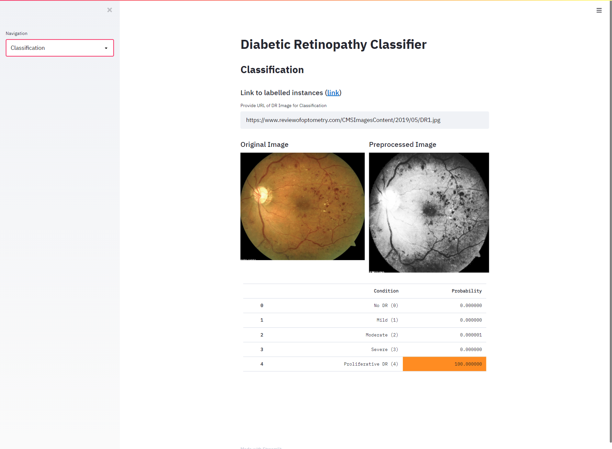
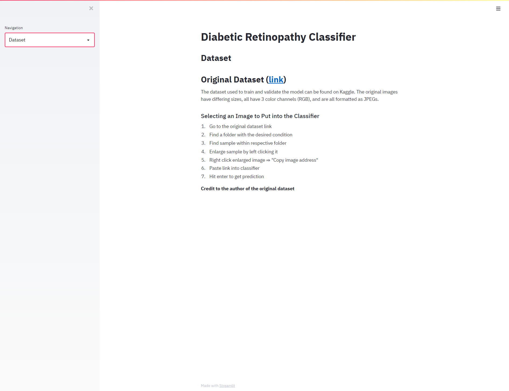
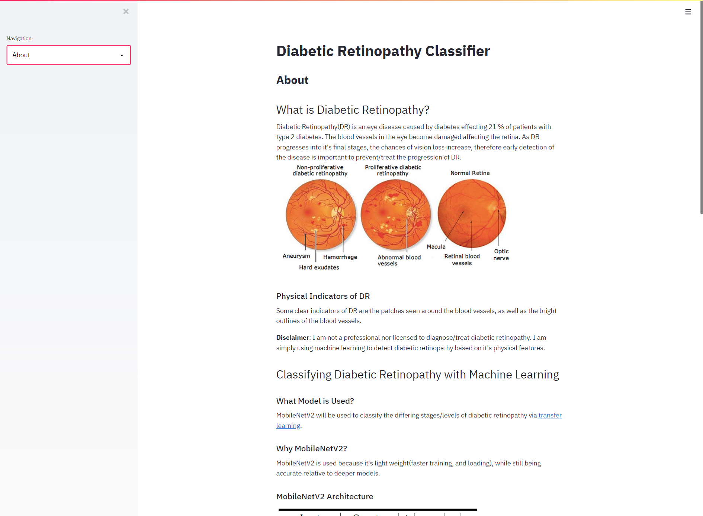

# Diabetic Retinopathy Online Classifier

**Disclaimer**: I am not a professional nor licensed to diagnose/treat diabetic retinopathy. I am simply using machine learning to detect diabetic retinopathy based on it's physical features.

This [web app](https://share.streamlit.io/jp-sdev/diabetic_retinopathy_web_app/main/app.py) predicts the severity of diabetic retinopathy given an image taken via Nonmydriatic digital retinal photography.

 
 
 

Details relating to the model - how it was built, technologies used to built the model, etc., can be found in my [notebook](https://github.com/JP-sDEV/Diabetic-Retinopathy-Classification)

This web app was built using [Streamlit](https://streamlit.io/)
